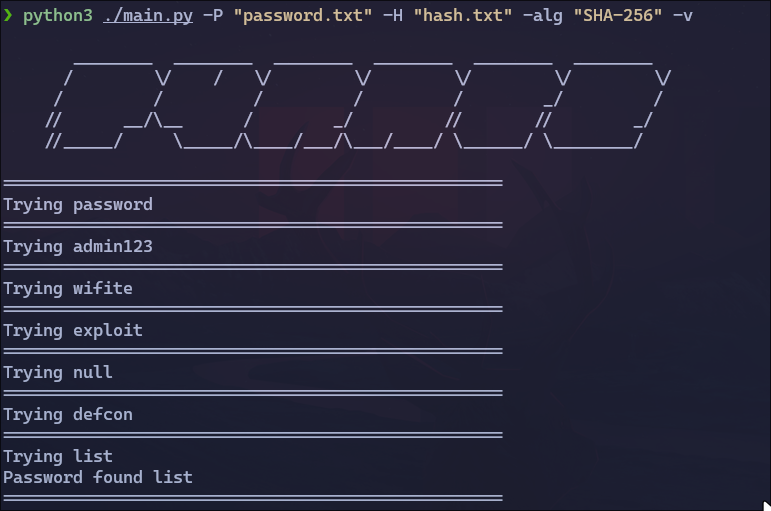

# pyrate

&emsp;

A python password cracker 
algorithms supported sha-512, sha-1, sha-256, md5

## **Screenshots**
&emsp;

# Usage
pip install -r requirements.txt

python3 ./main.py -P "password.txt" -H "hash.txt" -alg "SHA-256" -v
